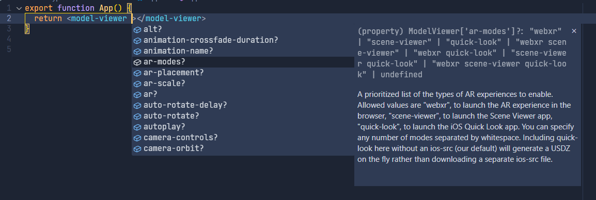

# Model Viewer Types

[](https://npmjs.com/package/model-viewer-types)
[](https://npmjs.com/package/model-viewer-types)
[](https://github.com/microsoft/TypeScript)
[](LICENSE)

Una librería de definiciones de tipos para la librería
[@google/model-viewer](https://www.npmjs.com/package/@google/model-viewer), diseñada para proporcionar soporte de tipos
y autocompletado en entornos de desarrollo TypeScript. Esta librería facilita la integración de model-viewer en
proyectos, mejorando la experiencia de desarrollo y reduciendo errores.

## Uso

Ejemplo en un proyecto usando react y typescript:

```tsx
// src/main.tsx

import { StrictMode } from 'react'
import { createRoot } from 'react-dom/client'

import '@google/model-viewer' // Importar la librería de model-viewer
import 'model-viewer-types' // Importar la librería de tipos para model-viewer

function App() {
  const viewer = useRef<ModelViewerRef>(null)
  return <model-viewer ref={viewer} class="my-model"></model-viewer>
}

createRoot(document.getElementById('root')!).render(
  <StrictMode>
    <App />
  </StrictMode>
)
```

Con esto logramos el siguiente autocompletado en vsCode:



## Licencia

[MIT](LICENSE) &copy; Edixon Piña
